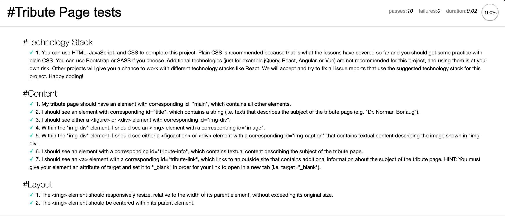

# Tribute Page - Wanda Maximoff

#### _Responsive Web Design Certification - `freeCodeCamp - Project 1`_

### :rocket: Projeto desenvolvido para `Certificação de Web Design Responsivo` da plataforma `freeCodeCamp`.  

### :dart: Objetivo: construir uma `Tribute Page`, preenchendo `user stories` aprovados em testes. 

### :white_check_mark: Tecnologias utilizadas: `HTML5` e `CSS3`.

#### 🌎 *[Tribute Page - Wanda Maximoff](https://bit.ly/31OUN4x)*
#### 🌎  *[CodePen](https://bit.ly/3el52F7)* - *[freeCodeCamp](https://bit.ly/31P61FW)* 

[Preview - Home]

[Tests]

